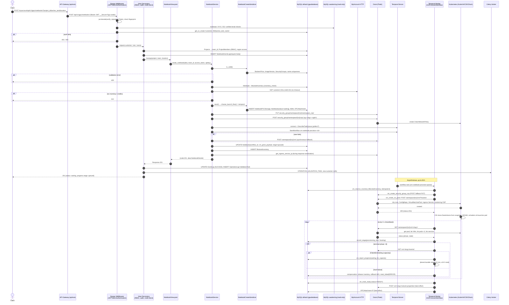

```mermaid
sequenceDiagram
    autonumber
    actor Client
    participant GW as API Gateway (apiman)
    participant MW as Django Middleware<br/>(JWTTokenAuthentication)
    participant DEC as View Decorators<br/>(RBAC, audit, credit block)
    participant V as NotebookView.post
    participant SVC as NotebookService
    participant SER as NotebookCreateSerializer
    participant DB as MySQL default (gpudatabase)
    participant AW as MySQL awakening (read-only)
    participant MYA as MyAccount HTTP
    participant GR as Groot (Flask)
    participant TS as Temporal Server
    participant WK as Temporal Worker<br/>(VmProvisionWorkflow)
    participant K8S as Kubernetes (KubeVirt/CDI/Cilium)
    participant MQ as Celery broker

    Client->>GW: POST /myaccount/api/v1/gpu/notebooks/?project_id&active_iam&location
    GW->>MW: POST /api/v1/gpu/notebooks/ (Bearer JWT, __Secure-Fgp cookie)
    MW->>MW: jwt.decode(verify_signature=False), check fingerprint
    MW->>AW: lockdown / KYC / D5 / verified-email checks
    MW->>DB: get_or_create Customer, IAM(active_iam), owner
    alt auth fails
        MW-->>Client: 401 / 403
    end
    MW->>DEC: request.customer / iam / owner
    DEC->>DB: Projects → team_id, ProjectMembers (RBAC), region access
    DEC->>DB: INSERT NotebookEventLog(request body)
    DEC->>V: kwargs(project, team, location)
    V->>SVC: create_notebook(data, team_id, access_token, apikey)
    SVC->>SER: is_valid()
    SER->>DB: SkuItemPrice, ImageVersion, SecurityGroups, name uniqueness
    alt validation error
        SVC-->>Client: 400
    end
    SVC->>DB: K8sNode − BlockedInventory (inventory_check)
    SVC->>MYA: GET customer-infra-credit-info (no timeout)
    alt no inventory / credits
        SVC-->>Client: 412
    end
    SVC->>SER: save() → choose_launch_flow() = temporal
    SER->>DB: INSERT NotebookPVCStorage, Notebook(status=waiting), M2M, VPCAttachment
    SVC->>GR: PUT security_group/namespace/{ns}/namespace_cnp/
    SVC->>GR: POST security_group/namespace/{ns}/cnp/ (sg-<slug>-<sgid>)
    GR->>K8S: create CiliumNetworkPolicy
    SVC->>TS: connect + DescribeTaskQueue (pollers?)
    SVC->>TS: StartWorkflow vm-notebook-provision-<id>
    alt start fails
        SVC->>GR: POST namespace/{ns}/vm/ (synchronous fallback)
    end
    SVC->>DB: UPDATE Notebook(workflow_id, vm_groot_payload, stage=queued)
    SVC->>DB: INSERT BlockedInventory
    SVC->>GR: get_ingress_service_ip (during response serialization)
    SVC-->>V: {code:201, data:NotebookDetails}
    V-->>DEC: Response 201
    DEC->>DB: UPDATE EventLog SUCCESS, INSERT OperationLog+ValidationTask
    DEC->>MQ: OPERATION_VALIDATION_TASK, new-customer notify
    DEC-->>Client: 201 {status: waiting, progress.stage: queued}

    Note over TS,WK: Asynchronous, up to 26 h
    TS->>WK: workflow task (vm-notebook-provision-queue)
    WK->>DB: vm_reserve_inventory (BlockedInventory, idempotent)
    WK->>GR: vm_create_security_group_cnp (POST, fallback PUT)
    WK->>GR: vm_create_on_groot: POST namespace/{ns}/vm/?location
    GR->>K8S: dry-runs, ConfigMaps, VirtualMachinePool, ingress Service, monitoring CNP
    K8S-->>GR: created
    GR-->>WK: 200 {status:201}
    K8S->>K8S: CDI clone DataVolume from snapshot, VM/VMI, schedule virt-launcher pod
    loop every 5 s (heartbeat)
        WK->>GR: GET namespace/{ns}/vm/<slug>/
        GR->>K8S: get pool, list VMs, list pods ×2, list services
        GR-->>WK: status {phase, state}
        WK->>DB: record_stage(provisioning_disk / booting)
        opt terminal phase ×3
            WK->>GR: GET vm/<slug>/events/
            alt FailedScheduling (capacity)
                WK->>DB: vm_report_progress(waiting_for_capacity)
                WK->>WK: jittered durable sleep (≤5 min, ≤24 h total)
            else hard failure
                WK->>DB: compensation: release inventory, rollback MIG, mark_failed(ERROR)
            end
        end
    end
    WK->>DB: vm_mark_ready (status=READY)
    WK->>GR: POST vm/<slug>/volume-properties/ (best effort)
    WK->>DB: VPCAttachment IP (best effort)
```
